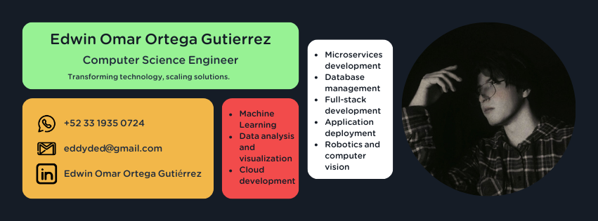
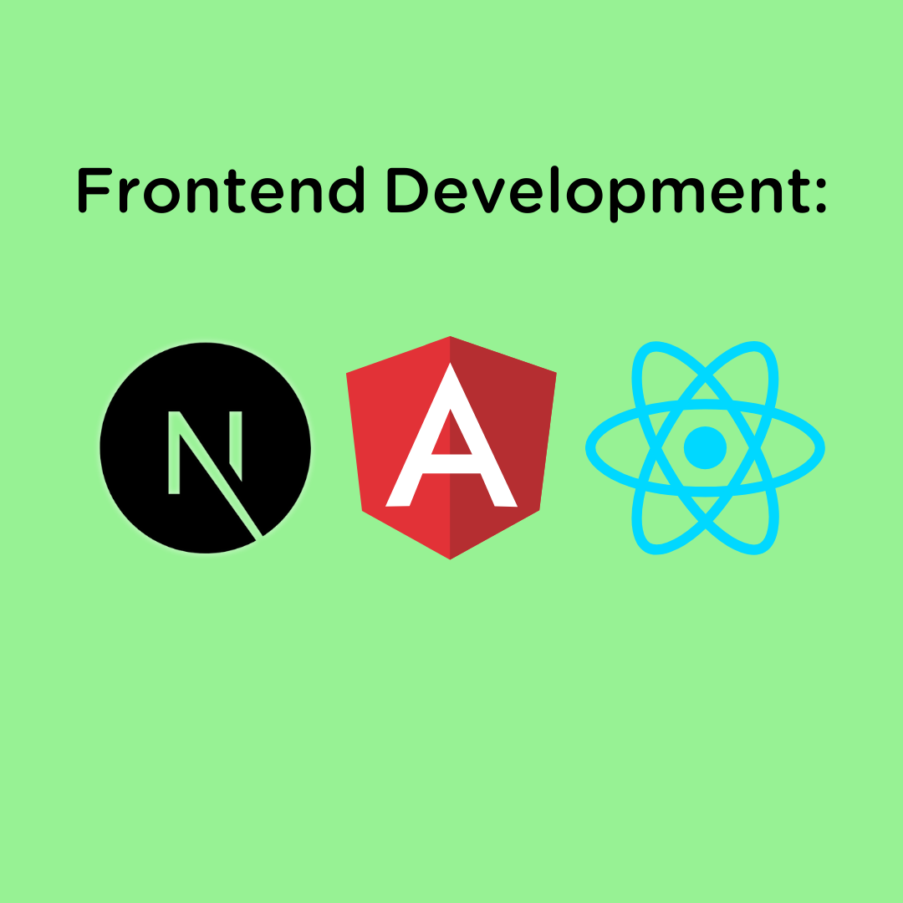
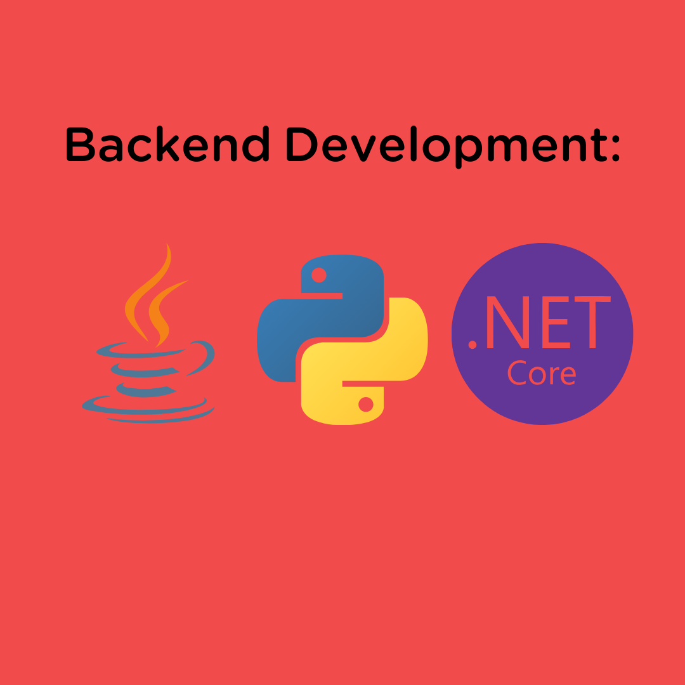
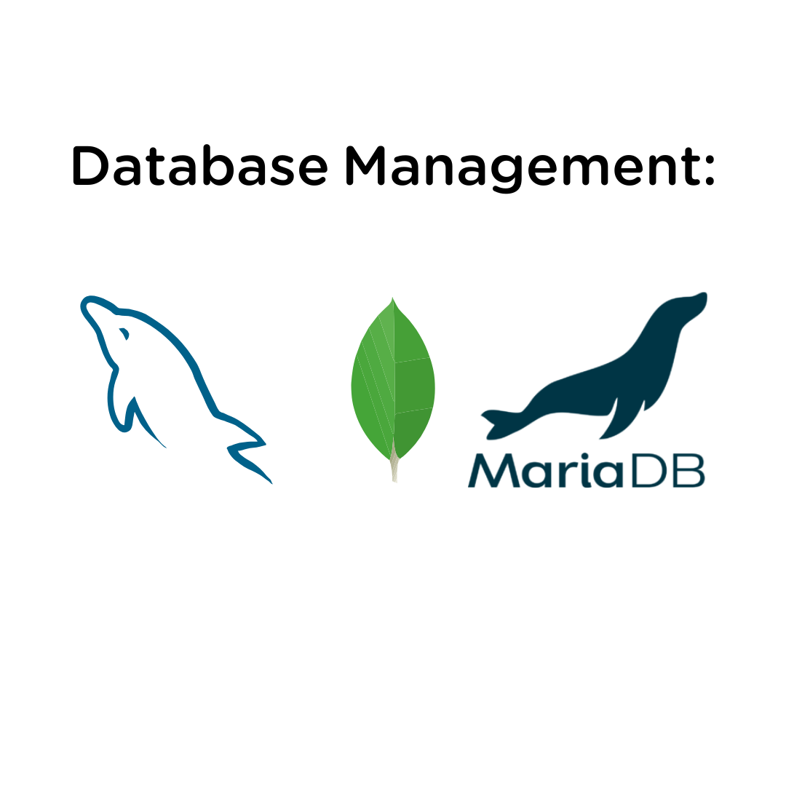
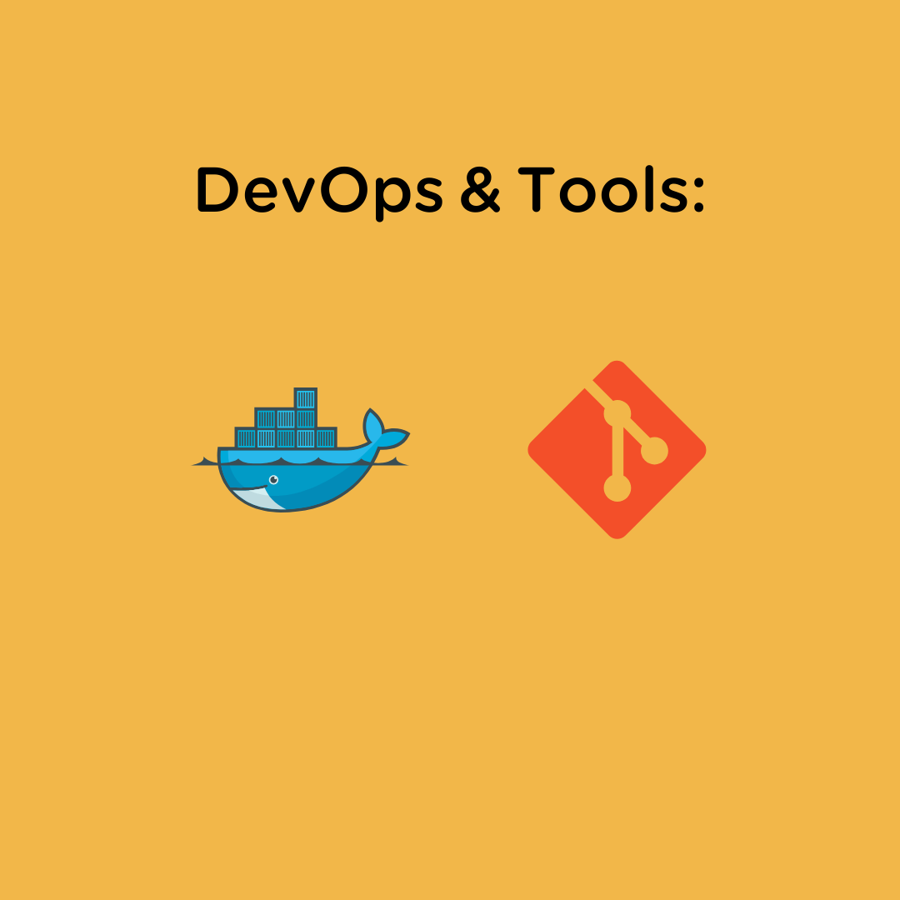
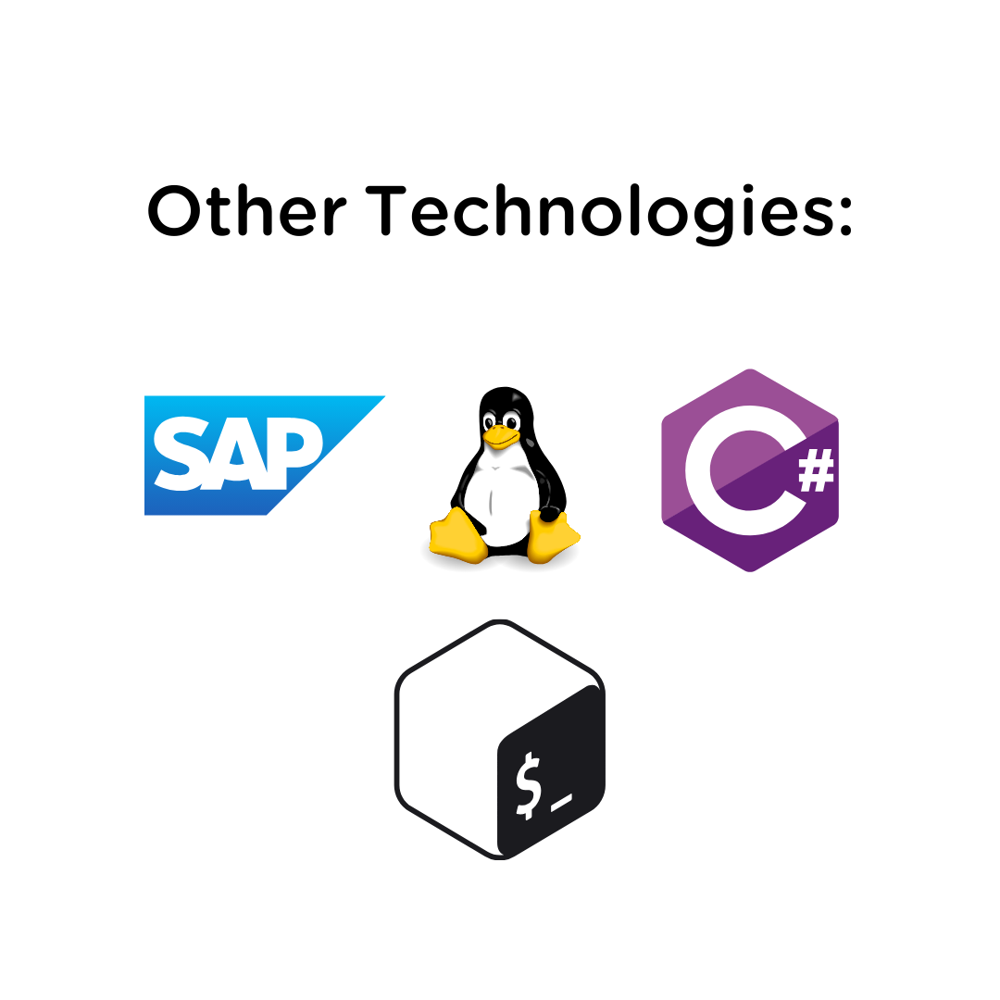

 
     

# Hi 👋, I'm Ortega Edwin.
 
    I am a Computer Science Engineer passionate about sustainable technological development and creating scalable solutions. Throughout my career, I have worked on various projects, ranging from AI-based applications to implementing robust backend infrastructures with microservices and REST APIs. My experience spans from collaborating with large corporations like IBM to developing innovative projects in robotics and computer vision. With skills in programming languages such as Python, C#, and frameworks like Angular and React, I specialize in building efficient and optimized systems for diverse industries. Additionally, I have a strong interest in musical composition and technology applied to music.

 

 
     

    

- Currently working on [Dsanro](https://dsanro.com/accountingservices/)
- Currently involved in the project [UDG SPACE: Mars Rover.](https://www.instagram.com/marsrover_udegspace/?theme=dark)
- Currently learning **advanced cloud hosting and Linux server management.**
- 👯 Looking to collaborate on **AI-based projects, full-stack development, and innovative robotics.**
- 🤝 Looking for help with **cutting-edge technologies in computer vision and machine learning.**
- 👨‍💻 All of my projects are available at [https://github.com/EdwinOrtegaGutierrez](https://github.com/EdwinOrtegaGutierrez)
- 💬 Ask me about **cloud infrastructure, AI, robotics, backend and frontend development, and microservices.**
- 📫 How to reach me: **eddyded49@gmail.com**
- 📄 Know about my experiences: [https://github.com/EdwinOrtegaGutierrez](https://github.com/EdwinOrtegaGutierrez)
- ⚡ Fun fact: **I'm passionate about merging music with technology.**

### Connect with me:

    
    
    
    

### Languages and Tools:

     
     
     
     
     

### Support.

    
    

### GitHub Information.

    

    
&nbsp;

    

